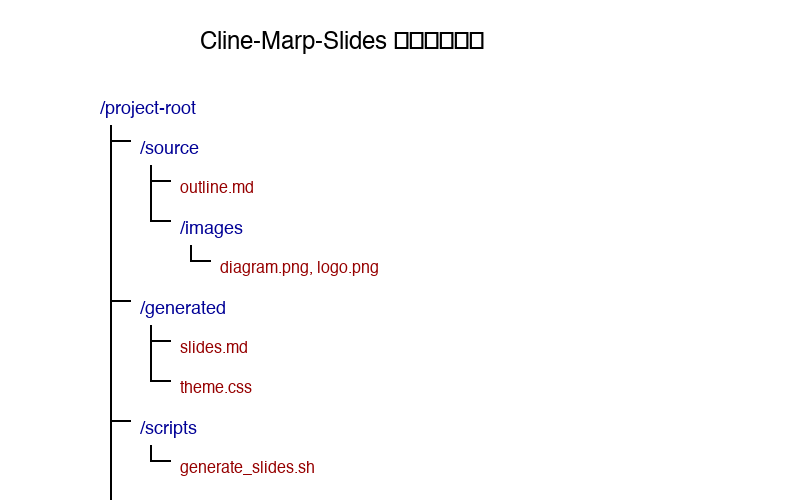

# Clineを活用したMarpスライド生成システム

2025年3月14日

---

## はじめに

- **このシステムの目的**：Markdown形式のスライドを自動生成
- **Clineとは**：VS Codeの AI コーディング支援拡張
- **Marpとは**：Markdownからスライドを生成するツール

---

## システムの概要

- アウトラインからスライドを自動生成
- 画像の管理方法
- フォルダ構成の説明



---

## 使い方

1. **アウトラインの書き方**：自由なフォーマットで記述
2. **スライド生成コマンド**：スクリプトを実行
3. **Marpでのプレビュー方法**：VS Codeで確認

```bash
./scripts/generate_slides.sh
```

---

## デモンストレーション

- サンプルスライドの生成
- 画像の挿入例
- デザインのカスタマイズ


---

## まとめ

- **システムのメリット**：効率的なスライド作成が可能
- **今後の改善点**：テンプレートの拡充

お問い合わせ：example@example.com